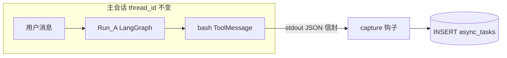
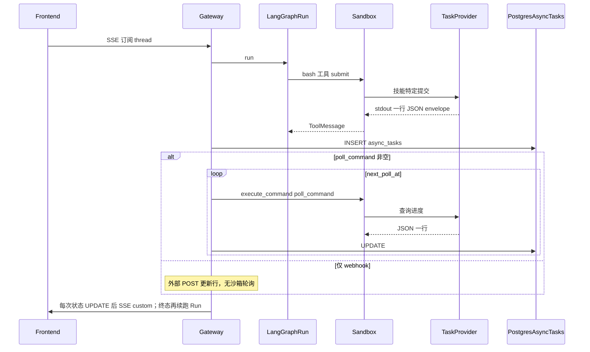

# 对话通用长任务 + 后台调度 + UI 推送（不含工作流）

## 范围说明

- **不包含** [workflow_runs](backend/scripts/init_app_database.py) / `node_tasks`；长任务仅绑定 **`thread_id` + `user_id`**，可选 **`source_run_id`**。
- **`async_tasks` 面向所有长任务**，不限 VASP：例如 HPC 作业、第三方异步 API（submit→poll）、纯 **Webhook 回调**（无轮询）、本地沙箱内耗时脚本的分阶段汇报等。
- **VASP** 仅是 `task_kind` 的一类实现示例（submit + 沙箱 poll）。

---

## 长任务创建契机（何时写入 `async_tasks`）

**默认唯一入口：对话里某次工具调用返回了符合契约的 stdout（信封），由网关侧捕获逻辑入库。**  
不是「用户一发消息就建任务」，也不是「每条 run 都建」。

### 主路径（推荐）

1. 用户在 **主会话**（某个 `thread_id`）里发送消息，触发 LangGraph **Run A**（`source_run_id = Run A`）。
2. Agent 调度 **bash / 技能工具**，在沙箱里执行 submit；进程结束时 stdout **最后一行（或扫描得到的）JSON** 满足统一信封，且 `status` 表示异步已提交（如 `submitted`）。
3. **ToolMessage 写入完成前后**，由 **`on_tool_end` 类中间件**（或等价钩子）调用捕获函数：解析 `ToolMessage.content`，用 **`resolve_envelope(raw)`** 得到结构化对象。
4. 从 **RunnableConfig / 中间件注入的 ctx** 读取并校验：`user_id`、`thread_id`、`run_id`（当前 Run A）、`tool_call_id`。缺一不可则 **跳过入库**（避免脏数据）。
5. **INSERT `async_tasks`**：`task_kind`、`external_ref`、`poll_command`、`poll_interval_seconds`、`payload`（完整信封）、`next_poll_at = now + first_interval`、`status` 见下条。
6. **初始 `status`**：`poll_command` 非空 → `queued`（或 `pending` 后立即转 `queued`）；**纯 webhook**（`poll_command` 为空）→ **`awaiting_callback`**，与后文调度器逻辑一致。
7. **幂等**：同一 `(thread_id, source_run_id, source_tool_call_id)` **仅允许一行**（库 UNIQUE 或捕获前 SELECT 已存在则跳过），避免重试/流重放双插。
8. **此时用户侧的 Run A 通常已继续或结束**——长任务行已与「触发它的那条工具气泡」通过 `source_tool_call_id` 关联。



### 不会创建长任务的情况

- 工具输出 **无** 有效信封（纯日志、非 JSON、缺字段）。
- **缺少** `user_id` / `thread_id` / `run_id` 上下文（配置关闭或未注入）。
- 同步短任务：信封若标明 **非异步**（可在契约中加 `"defer": false"`，可选）。

### 可选次要入口（实现阶段按需）

- **管理/调试 API**：`POST /internal/async-tasks` 手工登记（带审计）。
- **Webhook 预注册**：外部系统先创建 `awaiting_callback` 行（少见）。

---

## 状态变更时的 DB 更新与推送（不限于「成功完成」）

**原则**：只要 **`async_tasks` 行发生有意义的 status 变化**，就应 **更新 DB**；是否发 **SSE**、是否触发 **续跑 Run**，按「中间态 vs 终态」区分。**失败、取消、超时与成功一样要写库并通知用户**，不能只处理 `succeeded`。

### 状态分层

| 类别 | `status` 示例 | DB | SSE `custom` | 续跑 Run（同一 thread） |
|------|----------------|-----|----------------|---------------------------|
| **中间态** | `queued` → `running`（外部仍在跑）；poll 返回仍 `submitted`/`running` | 每次探测 **UPDATE** `status`、`heartbeat_at`、`next_poll_at`、`payload` 增量 | **建议每次都发**，便于角标/列表实时刷新 | 默认 **不** 启（避免刷屏）；若产品要强提示「已开始跑队列」可在首次 `running` 时可选启一次 |
| **业务失败** | `failed`（作业失败、返回码非零、SLURM `FAILED` 等） | **UPDATE** `error`、`finished_at`、`next_poll_at=NULL` | **发**，`outcome: failed` | **应** 续跑：注入 HumanMessage 说明失败原因，让 Agent 帮用户改参/重试 |
| **系统/调度失败** | `failed`（沙箱 poll 命令连续抛错、超过 `max_attempts`） | 同上，`error` 区分 `code: poll_exhausted` 等 | **发** | **应** 续跑（文案不同） |
| **用户取消** | `cancelled` | **UPDATE** `finished_at` | **发** | 按产品：**可选** 续跑一句确认，或仅 SSE |
| **超时** | `timeout`（可选单独枚举，或并入 `failed` + `error.code`） | **UPDATE** | **发** | **应** 续跑或仅 SSE |
| **成功** | `succeeded` | **UPDATE** `result`、`finished_at` | **发**，`outcome: succeeded` | **应** 续跑：注入「已完成」类 HumanMessage，便于总结与下一步 |

**metadata 命名**：避免仅用 `async_task_completed`。推荐统一用 **`trigger: async_task_terminal`**，并带 **`outcome`**：`succeeded` | `failed` | `cancelled` | `timeout`，便于审计与前端分支。

### SSE `custom` 建议载荷（每次状态变更）

```json
{
  "type": "async_task_update",
  "task_id": "uuid",
  "task_kind": "vasp_relax",
  "status": "running",
  "previous_status": "queued",
  "external_ref": "113289082",
  "outcome": null,
  "finished_at": null,
  "error": null
}
```

终态时 `outcome` 与 `status` 对齐，`finished_at` ISO8601。

### 续跑 Run（主会话同一 `thread_id`）

- **成功**：HumanMessage 模板侧重「结果在哪、请继续分析」。
- **失败**：模板侧重「错误摘要、是否重试」——**同样走 RunManager.create + run_agent**，不要假定用户只看成功续聊。
- **取消/超时**：可实现为仅 SSE + 极简续跑，或仅 SSE。

### 前端行为（不变）

- 同一 thread 上出现 **新 Run（Run B）** 时，订阅 thread 级流或 runs 列表即可；产品决定「自动跟最新 run」或「时间线合并」。

---

## 网关职责边界（与任务类型无关）

- **网关**：到期调度、解析统一 **stdout JSON 信封**、更新 `async_tasks`、触发续跑与 SSE。**不写死** SLURM/SSH/具体厂商协议。
- **沙箱**（或与 submit 同源的运行环境）：执行 `poll_command` 里的任意脚本；凭据、依赖、网络假设均在沙箱侧。
- **Webhook**（可选路径）：外部系统在作业完成时 **POST** 网关签名接口，直接 `UPDATE async_tasks`，无需 `poll_command`。与「沙箱轮询」二选一或组合（先 webhook 注册，超时再 poll）。

「网关不直接查 HPC」应理解为：**网关不执行领域探测命令**；对 **非 HPC** 任务同理——网关不直接 `curl` 第三方 API，除非把命令放进沙箱 `poll_command`。

---

## 端到端流程（概念）



---

## 表结构 `async_tasks`（通用，非 VASP 专用）

下列字段为 **推荐定稿**；命名可做微调，语义应保持。

| 列 | 类型 | 说明 |
|----|------|------|
| `id` | UUID PK | |
| `user_id` | VARCHAR(64) NOT NULL | 租户隔离 |
| `thread_id` | VARCHAR(64) NOT NULL | 会话 |
| `source_run_id` | VARCHAR(64) NULL | 触发工具时的 LangGraph run |
| `source_tool_call_id` | VARCHAR(128) NULL | UI 锚定气泡 |
| `task_kind` | VARCHAR(64) NOT NULL | 机器可读类别：`vasp_relax`、`http_async_job`、`webhook_only`、`custom` 等 |
| `display_name` | VARCHAR(256) NULL | 可选：列表/角标展示名 |
| `status` | VARCHAR(32) NOT NULL | `pending` → `queued` → `running` → `succeeded` \| `failed` \| `cancelled`；webhook 等待中可用 `awaiting_callback` |
| `payload` | JSONB NOT NULL DEFAULT '{}' | 创建时完整信封 + 任意扩展（厂商 id、路径、选项） |
| `poll_command` | TEXT NULL | **沙箱内**执行的完整 shell 命令；**NULL** 表示不走沙箱轮询（例如纯 webhook、或仅人工关闭） |
| `poll_interval_seconds` | INTEGER NOT NULL DEFAULT 1800 | 调度间隔上限；可被信封覆盖 |
| `next_poll_at` | TIMESTAMPTZ NULL | 到期扫描；终态清空 |
| `external_ref` | VARCHAR(512) NULL | **通用外部关联**：队列 job id、三方 request_id、ticket 号等 |
| `result` | JSONB NULL | 成功摘要（结构化） |
| `error` | JSONB NULL | 失败信息 |
| `attempts` | INTEGER NOT NULL DEFAULT 0 | 沙箱 poll **执行失败**（非业务失败）计数 |
| `max_attempts` | INTEGER NOT NULL DEFAULT 10 | 超过则 `failed` |
| `heartbeat_at` | TIMESTAMPTZ NULL | 可选存活探测 |
| `resume_run_id` | VARCHAR(64) NULL | 终态后续跑 |
| `terminal_followup_done` | BOOLEAN NOT NULL DEFAULT FALSE | 终态已触发续跑+SSE 打包逻辑，防重复（也可用 `resume_run_id IS NOT NULL` 推断，二选一） |
| `callback_secret` | VARCHAR(128) NULL | Webhook HMAC 验签（若启用） |
| `created_at` / `updated_at` / `finished_at` | TIMESTAMPTZ | |

**唯一约束（推荐）**：`UNIQUE (thread_id, source_run_id, source_tool_call_id)`（`source_tool_call_id` 非空时）；或应用层幂等。

**索引建议**：`(thread_id, status, created_at DESC)`；`(next_poll_at) WHERE status IN ('queued','running','awaiting_callback')`（部分索引视方言而定）；`(user_id, thread_id)`。

### 合理性说明

- **`task_kind` + `payload`**：区分业务；扩展新长任务类型只需新 kind 与信封约定，**无需改表**。
- **`poll_command` 可空**：支持 **Webhook-only**、**人工标记完成**、或「仅记录外部 id、由别的系统写回」。
- **`external_ref` 语义宽泛**：不限 Slurm id。
- **不把 VASP 字段**（如 `potcar_functional`）提成列；一律进 `payload`。

---

## 统一 stdout JSON 信封（工具提交时）

所有技能在「异步提交成功」时应打印 **一行 JSON**（概念契约），网关/`async_tasks` 写入逻辑只解析此契约，与 `task_kind` 无关：

```json
{
  "status": "submitted",
  "task_kind": "vasp_relax",
  "external_ref": "113289082",
  "poll_interval_seconds": 1800,
  "poll_command": "python -m vasp_skills_lib.cli poll ...",
  "display_name": "Fe relax"
}
```

或 Webhook 模式：

```json
{
  "status": "submitted",
  "task_kind": "vendor_xyz",
  "external_ref": "req_abc",
  "poll_interval_seconds": null,
  "poll_command": null,
  "callback_secret": "生成的单次令牌"
}
```

捕获入库时：信封可为 `"status":"submitted"`，但 **`poll_command` 为空** → 行记录 **`status = awaiting_callback`**（与信封用词区分，避免调度器误扫）。

调度器：`poll_command` 非空 → 沙箱轮询；`poll_command` 为空且 `status = awaiting_callback` → **不参与** tick 扫描，仅 **Webhook POST** 或 **超时转 `failed`**（需单独超时列或 `next_poll_at` 作为 webhook 截止时刻）。

### Poll stdout → 行内 `status` 映射（建议统一）

沙箱 `poll_command` 输出的 JSON 宜用 **`phase` 或 `status`** 字段；网关映射到表字段：

| poll 输出（示例） | `async_tasks.status` | 说明 |
|-------------------|----------------------|------|
| `submitted` / `running` / `pending` | `running` | 外部仍在进行；若当前行还是 `queued` 则首次置 `running` |
| `completed` / `succeeded` | `succeeded` | 与信封用词对齐时可约定别名 |
| `failed` | `failed` | 写入 `error` |
| `cancelled` | `cancelled` | |
映射应在实现中单点维护，避免 `completed` 与 `succeeded` 混用导致前端分支遗漏。

---

## 轮询、更新、推送 UI

### 调度间隔的定义（两层，勿混淆）

| 层级 | 含义 | 推荐定义方式 |
|------|------|----------------|
| **全局唤醒间隔 `T_tick`** | 网关里调度 **循环每隔多久醒来一次**去扫库（与具体任务无关） | 环境变量，例如 `DEER_FLOW_ASYNC_TASK_DISPATCH_TICK_SECONDS`，默认 **30**（开发可调小）；仅控制扫描频率，**不**等于每个任务的 poll 周期 |
| **单任务间隔 `poll_interval_seconds`** | **同一行**两次被探测之间的最小间隔 | 表字段（默认如 1800）；工具提交信封可覆盖；每次探测后 `next_poll_at = now() + poll_interval_seconds`（非终态） |

**到期条件**：`status` 为进行中类且 `poll_command IS NOT NULL` 且 **`next_poll_at <= now()`**；在某次 tick 内被 SELECT 出来执行。

**边界延迟**：实际触发时刻落在 **`[poll_interval_seconds, poll_interval_seconds + T_tick]`** 区间内（离散扫描 + 定时器抖动）。若要求「更接近实时」，应 **减小 `T_tick`**，而不是把 `poll_interval_seconds` 设为 1（会徒增空转扫描）。

**可选**：信封增加 `first_poll_delay_seconds`（创建后首次探测延迟，避免刚提交立刻打沙箱）。

### 调度器

- 按 **`T_tick`** 周期性运行；每次从 `async_tasks` 拉取 `next_poll_at <= now()` 且 **`poll_command IS NOT NULL`** 且 **非终态** 的行，`ORDER BY next_poll_at ASC`，可选 `LIMIT`。
- **多副本网关**：同一时刻仅一处处理——使用 **`SELECT … FOR UPDATE SKIP LOCKED`**（PostgreSQL）或对 `async_tasks.id` 乐观版本号；否则多实例会重复执行沙箱 poll。
- `execute_command(poll_command)` 在**常驻沙箱**内执行（同 thread 多任务时 **同 thread 串行**，避免并行占满 SSH）。
- 解析 stdout **最后一行 JSON**，按上文 **映射表** 更新 `status`；终态时若 **`terminal_followup_done`** 为假则发 SSE + 续跑并置真（或写入 `resume_run_id` 后视为已处理）。

### 推送（已选定）

- **每次有意义的 status 变更**：先发 **SSE custom**（见上文表格）。
- **进入任一终态**：再 **`RunManager.create` 续跑**（失败与成功不同文案）；`metadata.trigger = async_task_terminal`，`metadata.outcome` 区分结果。
- 模板文案按 **`task_kind`**、`outcome`、`display_name`、`payload` 渲染。
- 细则见上文 **「状态变更时的 DB 更新与推送」**。

---

## 沙箱生命周期（已选定：thread 级常驻）

- 某 `thread_id` 存在未终态 `async_tasks` 时 **常驻一个沙箱**，全部终态后 release。
- `poll_command` 必须可在该沙箱内执行（路径多用 `/mnt/user-data/...`）。
- **thread 内多任务**：共享同一沙箱；调度器对同一 `thread_id` **排队**执行 poll（一把锁或顺序队列），避免与正在进行的用户 bash 工具严重交错时可文档约定「poll 让位于用户工具」或统一入队。

---

## 全盘复查：可选优化与非目标边界

| 项 | 建议 |
|----|------|
| **SSE 中间态风暴** | 每次 `running` 都发可能较频；可 **合并**（仅 status 变化时发）或对 `custom` **防抖**（如同 task_id 500ms 内合并）——产品可选 |
| **Webhook 安全** | `callback_secret` 单次有效或短期 TTL；POST 校验 **path 中的 task_id + body 签名 + user 租户** |
| **跨进程重启** | `terminal_followup_done=false` 且已为终态：启动时可 **补偿扫描** 补发 SSE/续跑（谨慎幂等） |
| **`delivery_mode`** | 若希望显式区分沙箱轮询 / 纯 webhook / 混合，可加枚举列；否则由 `poll_command IS NULL` 推断即可 |

---

## VASP（附录：一种 task_kind）

- Submit：默认非阻塞，stdout 信封内含 `poll_command` 指向 `vasp_skills_lib` poll CLI。
- Poll：沙箱内读 `.calc_runtime/job.json`，`executor.poll` / `fetch`。
- 仅供参考；**其他技能复制同一信封模式即可**。

---

## 显式非目标

- 不与 `workflow_runs` / `node_tasks` Join。
- 网关进程内不执行领域探测（含 HPC、任意第三方 HTTP）；一律沙箱命令或 webhook。
- `async_tasks` 不包含仅 VASP 才有的列。
