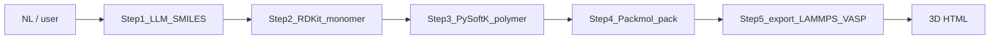

# polymer-build（PolymerBuild）

## When to Use

User wants a **repeatable pipeline** from **monomer chemistry** to **packed bulk morphology** and exportable **LAMMPS / VASP** inputs, with **3D visualization** of the **chain** and **packed cell**.

## Non-goals

- **Does not** submit or monitor cluster MD / DFT jobs (use existing `vasp-*` skills / HPC flow afterward).
- **Does not** guarantee one-shot chemical correctness from ambiguous natural language — ask for **repeat units**, **placeholder atoms**, **box size**, **numbers of chains**, and **blend ratios** when unclear.
- **LAMMPS `data.lammps`** is **`atom_style atomic`** (coordinates + types). **Full bonded MD topology** (angles, dihedrals, `full` style) is out of scope for this skeleton; users extend with a proper force-field workflow.

## Five-step pipeline

| Step | Who / what | Output |
|------|------------|--------|
| **1** | **LLM in this chat** | Canonical **SMILES** (or InChI) for the **monomer** only — no prose, no extra text. If the user only speaks natural language, you (the agent) perform Step 1 here, then run the scripts from Step 2 onward. |
| **2** | `step02_rdkit.py` | `monomer.sdf` — sanitize, Hs, ETKDG embed, MMFF/UFF. |
| **3** | `step03_pysoftk.py` | `polymer_chain.pdb` — `Lp` linear polymer (placeholder atom). |
| **4** | `step04_packmol.py` | `packmol.inp` → `packed.pdb` (calls **packmol** binary). |
| **5** | `step05_export.py` | `data.lammps`, `in.lammps`, `topology_notes.md`, `POSCAR`, `INCAR`, `KPOINTS`, `POTCAR.howto.txt` |
| **Viz** | `viz_html.py` | `polymer_build_3d.html` (+ optional `polymer_build_chain_only.html`) under the outputs directory (see below). |



## Step 1 rule (single source of truth)

- After you derive the monomer, record **one** SMILES string and pass it to the pipeline as `--smiles`.
- **Do not** invent a second SMILES inside a one-off script call to another model unless the user explicitly wants that alternate path — avoids drift between chat and files.

## PySoftK monomer convention

- `Lp` needs a **placeholder element** (often **`Br`**) marking connections between repeats — typical tutorial SMILES include two such markers.
- Expose `--placeholder`, `--n-copies`, `--shift` on `step03_pysoftk.py` / `run_pipeline.py`.

## One-shot command

From repo / sandbox (replace `{skill_dir}`):

```
python {skill_dir}/scripts/run_pipeline.py \
  --work-dir ./polymer_work \
  --smiles "<STEP1_SMILES>" \
  --placeholder Br \
  --n-copies 6 \
  --n-chains 4 \
  --box 40 40 40
```

- **`--prompt "..."`**: optional — stored in `manifest.json` for traceability only.
- **`--skip-packmol`**: stop after Step 3 (useful when Packmol is unavailable).
- **Blend / electrolyte-like packing**: pass extra PDB species counts, e.g. `--extra-pdb ./water.pdbx200` (repeat flag as needed).

## Incremental commands

```
python {skill_dir}/scripts/step02_rdkit.py --work-dir ./polymer_work --smiles "..."
python {skill_dir}/scripts/step03_pysoftk.py --work-dir ./polymer_work --placeholder Br --n-copies 6
python {skill_dir}/scripts/step04_packmol.py --work-dir ./polymer_work --n-chains 4 --box 40 40 40
python {skill_dir}/scripts/step05_export.py --work-dir ./polymer_work
python {skill_dir}/scripts/viz_html.py --work-dir ./polymer_work
```

All steps write/update **`manifest.json`** in `--work-dir`.

## Dependencies

- **Python**: `pip install -r {skill_dir}/requirements.txt` (**includes** `rdkit`, `pymatgen`, `openbabel-wheel`).
- **Step 3 (polymer chain)**: uses the **bundled** `polysoftk_lite/` excerpt (PySoftK `Lp` call chain only — see `polysoftk_lite/NOTICE` for upstream SHA and license). You do **not** need `pip install git+…pysoftk`.
- **Packmol**: install native binary — on **`PATH`**, or **`PACKMOL_BINARY`**, or **`--packmol-binary`**.
- **pymatgen** is required for Step 5 (also listed in `requirements.txt`).

## Outputs & `present_file`

- Prefer writing HTML to **`/mnt/user-data/outputs/`** when that directory exists (sandbox), else **`$POLYMER_BUILD_OUTPUTS`**, else **`<work_dir>/outputs/`**.
- **You must `present_file`** the generated **`polymer_build_3d.html`** (and optionally the chain-only HTML) so the user can rotate the **chain / packed** structure in-browser.

## POTCAR

- **Do not** duplicate periodic-table POTCAR heuristics here.
- Read **`POTCAR.howto.txt`** in the work directory and use the existing **`vasp-potcar`** skill / CLI under `skills/public/vasp-potcar` to generate **POTCAR** from the produced **POSCAR**.

## Failure policy

- Missing **RDKit**, **Open Babel Python bindings** (`openbabel-wheel`), **pymatgen**, or **packmol** must **error once with an explicit message** — never silently skip a step.

## Toolbox metadata (`toolbox_skills`)

After adding or changing this skill on disk, operators with PostgreSQL (`app_database.url` or `DEER_FLOW_APP_DATABASE_URL`) should:

1. `make sync-toolbox-skills` — upsert rows from disk into `toolbox_skills`.
2. `make backfill-skill-labels` — fill `laber_name` / `laber_description` for the UI using the repo’s **LLM** script (`scripts/backfill_skill_labels.py`); do **not** hand-edit Chinese labels in the database.
